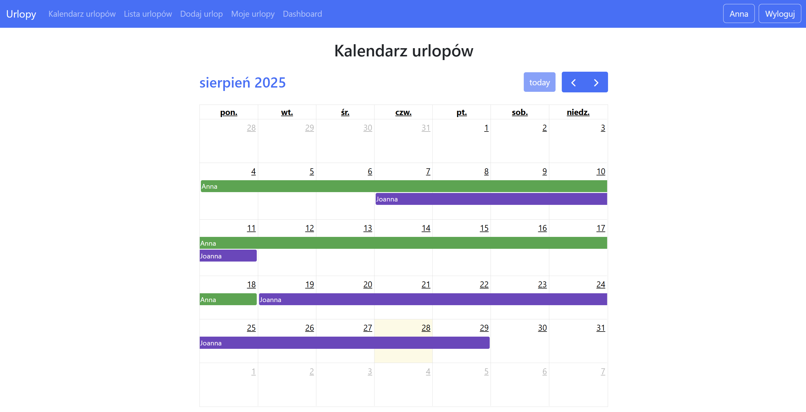

# Urlopy-app 
Aplikacja webowa napisana w FastAPI i SQLAlchemy, która umożliwia zarządzanie urlopami pracowników. Projekt pozwala na dodawanie, edytowanie i usuwanie wniosków urlopowych, a także przeglądanie ich w formie listy, kalendarza oraz dashboardu z podsumowaniem.

# Funkcjonalności
- Logowanie i role – użytkownicy mogą logować się do systemu, a administratorzy mają dodatkowe uprawnienia.
- Zarządzanie urlopami – dodawanie, edycja i usuwanie wniosków urlopowych.
- Widok kalendarza – przejrzyste przedstawienie urlopów wszystkich pracowników.
- Dashboard – zestawienie wykorzystanych i planowanych dni wolnych w danym roku.
- Panel użytkownika – wgląd w swoje dane, zmiana hasła, podgląd własnych urlopów.
- Obsługa świąt w Polsce – aplikacja automatycznie pomija dni ustawowo wolne od pracy.
- Powiadomienia e-mail – automatyczna wysyłka wiadomości po dodaniu urlopu.
  
# Kalendarz urlopów

# Technologie
- Backend: FastAPI, SQLAlchemy, Pydantic
- Frontend: Jinja2, Bootstrap 5, FullCalendar
- Baza danych: PostgreSQL
